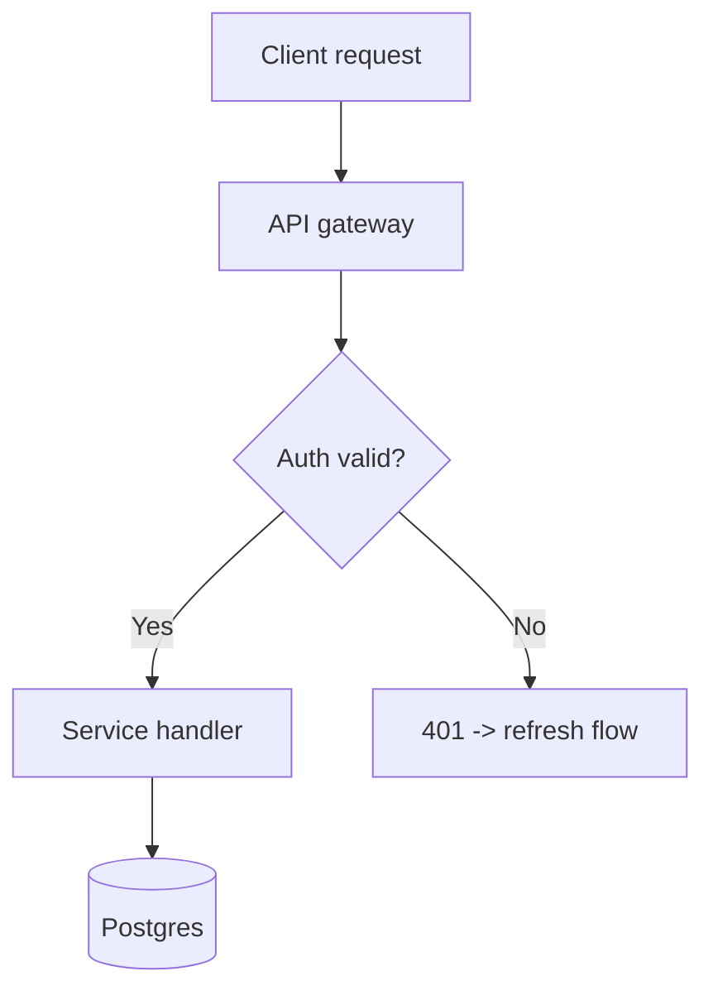

# 5 Obsidian Tips for Better Note-Taking

The highest-leverage Obsidian habits aren’t about capturing more notes — they’re about making the notes you already have findable, connected, and reusable. Borrowing a sharp line from Dann Berg’s systems writing: always know whether you’re working *on* your note-taking system or *in* it to do real work. Most vaults rot because their owners do plenty of the first and almost none of the second — capture is easy, reuse is the hard part. The five practices below are aimed squarely at reuse, written for developers who already speak Markdown fluently, so there’s no header-and-bullet-list primer here.


## Key Takeaways


- A Map of Content (MOC) is a hub note that links related notes with` \[\[wikilinks\]\]` ; pairing it with a Dataview query means the hub curates itself instead of forcing you to hand-maintain a list.
- Use Dataview for inline, text-based queries; reach for Bases — Obsidian’s native core database plugin since August 2025 — when you want a no-code, filterable table, card, list, or map view.
- Canvas is a built-in core plugin, and Obsidian renders` mermaid` diagrams natively, so you can diagram a service architecture without installing anything.
- The hard part of note-taking is reuse: a weekly Dataview dashboard of notes modified in the last seven days turns a write-only vault into one you revisit.
- An Obsidian vault is just a folder of Markdown files, so` git init` gives you free version history, line-level diffs, and cross-machine sync with no paid Obsidian Sync required.


## 1. Build Maps of Content — and know when Bases beats Dataview


A Map of Content (MOC) is a hub note that links related notes with` \[\[wikilinks\]\]` , then uses a query to curate them automatically. Instead of hand-maintaining a table of every` payments-service` note, you write links as you go and let a query surface them. The lightest version uses[Dataview](https://blacksmithgu.github.io/obsidian-dataview/) , a community query plugin, to list every note linking back to the current MOC:


```text
LIST FROM [[]]
```


` FROM \[\[\]\]` resolves to “notes that link to this note,” so any note you tag with` \[\[Payments MOC\]\]` shows up here with zero upkeep. Dataview reads your notes and never writes to them — its docs are explicit that it leaves metadata untouched — so a query can’t corrupt a vault.


The important 2026 update every older tips post misses: Obsidian Bases is a free core plugin that transforms your notes into an editable, filterable database inside Obsidian. It[shipped as a core plugin on August 18, 2025](https://obsidian.md/changelog/2025-08-18-desktop-v1.9.10/) , and all the data in a base is backed by your local Markdown files and properties stored in YAML. Per the[Bases documentation](https://help.obsidian.md/bases) , it is a core plugin for database-like views over files and properties: tables, cards, lists, and maps. That makes the choice a real decision, not a default:


Reach for Dataview when… Reach for Bases when…


You want queries inline in a note as plain text You want a no-code, GUI-filterable view


You need task rollups or computed inline fields You want table, card, list, or map layouts


Your logic is code-driven and expressive You want it stable, native, and mobile-friendly


Both run on the same YAML frontmatter, so investing in clean properties (` status:` ,` repo:` ,` updated:` ) pays off whichever you pick.


## 2. Link with intent and keep notes atomic


Link with intent: descriptive links make your graph navigable, while vague ones become noise.` \[\[JWT refresh-token rotation\]\]` tells you exactly what sits on the other side, while “see more here” produces a link you’ll never surface again. The payoff compounds: because every wikilink is bidirectional, the backlinks pane on` \[\[OAuth token refresh flow\]\]` becomes a live index of every incident writeup, standup note, and design doc that touched it — without you maintaining an index.


Keep each note atomic — one idea per note. An atomic note about` \[\[repo: payments-service\]\]` retry semantics is reusable across a dozen contexts; the same idea buried in a 2,000-word meeting dump is invisible. Atomic notes are also where new thinking comes from — connect two unrelated notes and the intersection is the idea neither source contained. Keep notes short and single-purpose, and let links, not folders, carry the structure.


## 3. Diagram systems with Canvas and Mermaid


Canvas is a built-in core plugin, not a community add-on — the[core plugins list](https://help.obsidian.md/plugins) describes it as a way to organize notes visually with an infinite space to lay out ideas. Drop live notes onto an infinite surface and wire them together to sketch a service architecture, an incident timeline, or an algorithm’s control flow, with each card linking back to the full note in your vault.


For diagrams that belong *inside* a note, embed a` mermaid` fence — Obsidian renders it natively with no plugin install (the current build[bundles Mermaid 11.13.0](https://obsidian.md/changelog/2026-05-28-desktop-v1.13.0/) ):


```text

```


This renders a request-lifecycle flowchart in reading view. Because it’s plain text in the note body, the diagram diffs cleanly in Git (see tip 5) and travels with the note — no binary image to regenerate when the architecture changes.


## 4. Turn Obsidian note-taking into a living knowledge base you review


The hard part of note-taking isn’t capture, it’s reuse — most notes are written once and never reopened. Treat your vault as a living knowledge base, not an archive: notes are mutable, and you should refactor, re-link, and prune them as you revisit. The mechanism that makes this stick is a standing review query. Drop a dashboard note with a Dataview block showing everything you’ve touched in the last seven days:


```text
LIST
WHERE file.mtime >= date(today) - dur(7 days)
SORT file.mtime DESC
```


Open it every Friday, and the vault stops being write-only. Add a companion query for open tasks (` TASK WHERE !completed` ) and bind the core Random Note command to a hotkey for serendipitous rediscovery. The habit matters more than the query: a note you never reopen is a note you never wrote.


## 5. Version and sync your vault with Git


An Obsidian vault is just a folder of Markdown files, so running` git init` inside it gives you free version history, line-level diffs, and cross-machine sync — no paid[Obsidian Sync](https://obsidian.md/pricing) required. You already own the tool; point it at your vault:


```text
cd   my-vault
git   init
printf   '  .obsidian/workspace.json\n.obsidian/workspace-mobile.json\n.trash/\n  '   >   .gitignore
git   add   .
git   commit   -m   "  Initial vault snapshot  "
```


The` .gitignore` keeps churn-heavy local state (window layout, trash) out of history while preserving your notes, plugin settings, and` .base` files. From there,` git log` and` git diff` show exactly how a note evolved — the kind of audit trail proprietary note apps can’t give you. Push to a private remote and` git pull` on your other machines to sync.


One honest caveat: Git is versioning plus asynchronous sync, not live collaboration — edit the same note on two machines before pulling and you’ll resolve a merge conflict by hand, just like code. For a solo vault that’s a fair trade. And if this is a work vault, there’s nothing to license:[Obsidian has been free for commercial use since February 2025](https://obsidian.md/blog/free-for-work/) , with the paid commercial license now optional.


---


Pick one of these to install this week — the Git init is fifteen minutes and the review dashboard is one query — rather than trying all five at once. The goal isn’t a more elaborate system; it’s a vault whose notes you actually reopen, connect, and reuse.


## FAQs


Is Bases replacing Dataview in Obsidian?


No. Bases is a native core plugin Obsidian shipped on August 18, 2025 that provides no-code, GUI-filterable database views, while Dataview remains a community plugin offering an expressive text-based query language inside notes. Both read from the same YAML frontmatter. Dataview still works and is widely used; the community increasingly pairs it with or replaces it by Bases, but Dataview has not been discontinued or abandoned.


Can I sync an Obsidian vault with Git without losing plugin settings?


Yes. A vault stores plugin configuration in the .obsidian folder as plain files, which Git tracks alongside your Markdown notes. Add only churn-heavy local state to .gitignore, such as .obsidian/workspace.json, .obsidian/workspace-mobile.json, and .trash/. This preserves community plugins, hotkeys, themes, and .base files across machines while keeping window-layout noise out of history. Git handles versioning and asynchronous sync, not real-time collaboration.


Does Dataview modify or corrupt my notes when running queries?


No. Dataview only reads note content and metadata to display and calculate results; its official documentation states it never edits your notes or metadata and always leaves them untouched. Queries render output in reading view without writing back to the source files, so a malformed query produces a display error rather than altering or corrupting vault data.


Do I need to pay for a license to use Obsidian for work?


No. Since February 20, 2025, Obsidian is free for commercial use at organizations of any size. The previously required commercial license, priced at 50 dollars per user per year, is now optional and exists only as a way to support Obsidian. This means Git-managing a work vault or using Obsidian on company machines carries no mandatory licensing cost.


Is Canvas a core Obsidian plugin or a community add-on?


Canvas is a built-in core plugin, not a community install. Obsidian's core plugins list describes it as a way to organize notes visually on an infinite space to lay out ideas. You enable it in settings without downloading anything from the community catalog. Canvas lets you place live vault notes onto an infinite surface and link them, so cards remain connected to their full source notes.


## Understand every bug


Uncover frustrations, understand bugs and fix slowdowns like never before with **OpenReplay** — self-hosted, with full data ownership.


[Star on GitHub](https://github.com/openreplay/openreplay)
